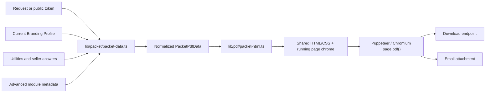

# UtilitySheet PDF System Reference

Last verified: July 6, 2026, on `main` at merge commit `9ff0ca4`.

This is the authoritative engineering reference for the downloadable Simple PDF and Property Handoff Packet (stored packet mode `advanced`). It describes the current production behavior after the Simple pagination work and the shared Simple/Advanced design-system work.

For the Branding Profile redesign implications, read [branding-profile-pdf-redesign-handoff.md](./branding-profile-pdf-redesign-handoff.md) next.

## Executive summary

Simple and Advanced are now two content modes of one PDF system, not separate visual templates.

Both modes use:

- the title `Utility Info Sheet`;
- one shared HTML/CSS document builder;
- selectable vector text produced by Chromium `page.pdf()`;
- the same brand header, title/address block, Home Basics, Utilities table, Buyer Next Steps, disclaimer, running header, and running footer;
- the Branding Profile's logo, primary color, contact information, display options, and buyer instructions;
- print-native pagination rather than a screenshot scaled onto a page.

Advanced adds canonical, metadata-driven detail sections between Utilities and Buyer Next Steps. It is expected to use multiple pages when the content requires them. Simple is compact and one-page-first, but it also paginates intentionally when content is too large.

| Behavior | Simple | Advanced |
| --- | --- | --- |
| Canonical title | `Utility Info Sheet` | `Utility Info Sheet` |
| Shared visual shell | Yes | Yes |
| Home Basics | When at least one value exists | When at least one value exists |
| Utilities | Yes | Yes |
| Advanced detail modules | No | Yes |
| Buyer Next Steps | Yes | Yes |
| Normal page target | One page when content permits | As many pages as content needs |
| Rendering | Chromium vector PDF | Chromium vector PDF |
| Filename prefix | `utility-info-sheet-` | `seller-transition-packet-` |

## Production flow



The principal entry points are:

- `GET /api/packet/[token]/pdf` for public-token downloads;
- `generatePacketPdf()` in `lib/pdf-generator.tsx` for the browser download action;
- `createPacketPdfAttachmentForPublicToken()` and `createPacketPdfAttachmentForRequest()` in `lib/pdf/packet-attachment.ts`;
- the email service, which uses the request-ID attachment path.

`lib/packet/packet-data.ts` is the content boundary. `lib/pdf/packet-html.ts` is the presentation boundary. Keep data normalization and plan gating out of the renderer when possible.

## Shared document anatomy

The production body order is:

1. Brand header
2. Centered document title, address, and optional date
3. Optional welcome message
4. Home Basics, when available
5. Utility Providers table
6. Advanced detail sections, in Advanced mode only
7. Buyer Next Steps
8. Optional disclaimer

Chromium adds separate running page chrome:

- Header: brand name on the left, property address on the right
- Footer: optional `Powered by utilitysheet.com` on the left, `Page X of Y` on the right

The disclaimer is part of the document body after Buyer Next Steps. Although the Branding Profile UI calls it a “Footer Disclaimer,” it is not placed in Chromium's repeating page footer.

## Shared visual language

The current shared hybrid design deliberately combines Simple's compact clarity with Advanced's accent-bar hierarchy.

- Font stack: Arial, Helvetica, sans-serif
- Base print size: `10pt`
- Body color: near-black Zinc (`#18181b`)
- Card border: light Zinc (`#e4e4e7`)
- Card radius: generally `8px`
- Section background: subtle neutral (`#f9fafb`)
- Accent: Branding Profile `primary_color`, with `#10b981` fallback
- Accent uses: section-heading left bars, initials tile, map pin, provider phone, welcome-message edge, and numbered Buyer Next Steps
- Logo height: `36px`, width automatic
- Fallback initials: first letters of the first two words; for example, `Multimedium Team` becomes `MT`

The `secondary_color` Branding Profile value does not currently affect either PDF. It is used in branded email surfaces.

## Simple PDF behavior

Simple is optimized to fit a normal utility sheet on one US Letter page without shrinking the whole document. The verified 112 Morris Place case includes five utilities, Home Basics, and four default buyer steps and renders as one page.

“One-page-first” is a layout goal, not a hard rule. Longer values, more providers, additional schedule details, a welcome message, a disclaimer, custom buyer steps, or unusually large branding can produce additional pages. When that happens, content flows through the same pagination rules used by Advanced.

Simple must remain:

- comfortably readable at print size;
- selectable/searchable text;
- free of whole-document transforms or dynamic scale-to-fit behavior;
- capable of repeating Utilities context on continuation pages.

## Property Handoff Packet behavior

The Property Handoff Packet (stored packet mode `advanced`) uses the same shell and shared sections as Simple, then inserts handoff detail modules after Utilities.

Current module keys and display sections are owned by `lib/packet/modules.ts`:

- `lawn_exterior`
- `irrigation_seasonal_controls`
- `mailbox_access`
- `smart_home_security`
- `service_providers`

Enabled modules and field exclusions are applied before rendering. Empty sections are removed from normal production data.

Field order and labels come from `ADVANCED_MODULE_FIELD_METADATA`, not JSON object insertion order and not database-key title-casing. This is why the packet displays deliberate labels such as `Plumber` instead of generated labels such as `Plumber Provider Name`.

Scalar display values are trimmed. Whole-value `yes` and `no` strings become `Yes` and `No`. Arrays are joined with `, ` while preserving their entered items.

## Pagination model

The pagination model depends on table semantics supported by Chromium paged media.

### Utility Providers

- One table owns both the section heading and the `Utility / Provider / Contact` column headings.
- Both heading rows live inside `<thead>`.
- `thead { display: table-header-group; }` repeats the context when the table crosses a page.
- Each provider row is atomic with `break-inside: avoid`.
- The whole table is allowed to fragment.

### Advanced detail sections

- Each module is a two-column table.
- The module title lives in a repeating `<thead>`.
- Fields are paired into atomic two-cell rows.
- Odd field counts receive an intentionally empty partner cell.
- The whole section table is allowed to fragment.
- Borders belong to individual cells so page continuation seams remain closed.

### Buyer Next Steps

- Individual step items are atomic.
- The section may flow between items when necessary.
- The complete section is not forced together, because a long customized list must remain printable.

### Compact blocks

The brand header, title block, welcome message, Home Basics, and disclaimer use keep-together rules. Headings avoid page breaks immediately after themselves.

Do not add `break-inside: avoid` to an entire Utilities table, Advanced section table, or long Buyer Next Steps section. That can force oversized content off-page or create blank space and clipping.

## Page and browser settings

Production PDF generation in `lib/pdf/packet-attachment.ts` uses:

- paper: US Letter;
- top margin: `0.65in`;
- bottom margin: `0.7in`;
- left/right margins: `0.55in`;
- `printBackground: true`;
- `displayHeaderFooter: true`;
- a Puppeteer/Chromium runtime resolved from configured Chrome, a Chromium binary/pack, or the default `@sparticuz/chromium` executable.

The builder currently always returns `renderStrategy: 'print_pdf'`. A legacy screenshot branch remains in `packet-attachment.ts`, but the current Simple and Advanced builder does not select it.

## Branding Profile inputs used by the PDFs

Both modes consume the same normalized brand object:

- brand name;
- logo URL;
- primary color;
- contact name, phone, email, and website;
- disclaimer;
- custom Buyer Next Steps and section title;
- powered-by preference;
- generation-date preference;
- welcome message.

Text is whitespace-normalized, clamped to the limits in `lib/branding/limits.ts`, and HTML-escaped. Colors must be 3- or 6-digit hex. Logos and provider URLs must resolve to HTTP(S). Contact websites may be entered without a scheme, but the PDF displays only the hostname.

The date labeled `Generated on` currently comes from `request.created_at`, not the exact moment the PDF is generated. A future redesign should preserve that behavior unless the product semantics are intentionally changed.

## Plan gating

Advanced mode is a paid feature. Branding behavior is also normalized by the account or organization plan before the renderer sees it.

For Free accounts:

- `Powered by utilitysheet.com` is forced on;
- the date is forced on;
- custom Buyer Next Steps are ignored in favor of defaults;
- a custom Buyer Next Steps title is ignored;
- the welcome message is omitted.

For Pro accounts and Team organizations:

- those display preferences and customizations are honored;
- the user may choose Advanced mode and enabled Advanced modules.

Core identity/contact fields and disclaimer are passed through when a brand profile is present.

## Profile resolution and data freshness

When a PDF is requested, the system resolves branding in this order:

1. Fetch the profile referenced by `request.brand_profile_id`.
2. If it is missing or unavailable, fetch the default profile for the request's organization or account.
3. If no profile is marked default, `getDefaultBrandProfile()` falls back to the oldest profile in that scope.

The request stores a profile ID, not a snapshot of the profile's visual values. Regenerating an old request after editing its Branding Profile generally uses the profile's current values. Deleting the referenced profile sets `brand_profile_id` to null at the database level, after which default-profile fallback applies.

## Filenames and delivery

The address portion uses the first comma-separated address segment, replaces non-alphanumeric runs with hyphens, trims it to 60 characters, and falls back safely when needed.

- Simple: `utility-info-sheet-<address>.pdf`
- Advanced: `seller-transition-packet-<address>.pdf`
- Content type: `application/pdf`

Packet attachments are skipped for missing, unsubmitted, or locked requests. The public PDF route maps those states to its HTTP responses; email attachment generation logs and returns a structured failure without crashing the surrounding email flow.

## Preview and test-PDF architecture

Production PDF output is authoritative, and since the July 2026 Branding Profile redesign the preview surfaces reuse it rather than approximating it:

1. `components/branding/UtilitySheetPdfPreview.tsx` renders the production HTML from `buildPacketPdfHtml()` inside a sandboxed, scale-to-fit iframe at the exact print content width (7.4in at 96 CSS px/in). It cannot drift from production markup or CSS. Page breaks, running headers, and page numbers exist only in the printed PDF; the preview shows the document as one continuous sheet and says so.
2. The editor's "Download test PDF" action posts the unsaved form values to `POST /api/branding/test-pdf`, which renders through the same Chromium `page.pdf()` pipeline and page settings as real downloads (real pagination, selectable text, running header/footer, page numbers). Plan gating is applied server-side.
3. Both surfaces share one synthetic fixture and one gating implementation: `lib/branding/preview-data.ts` (`buildBrandingPreviewPacketData`). The fixture includes Home Basics, five utilities with trash-schedule and meter details, and, in Advanced mode, every advanced module built from canonical metadata examples. Free accounts always receive the Simple document with Free-plan output rules.
4. The old client-side screenshot helper (`lib/pdf/client-screenshot-pdf.ts`) was removed. `lib/demo-pdf-generator.tsx` remains a separate screenshot-style demo generator and should not be treated as the production PDF template.

## Verification completed for the shared system

The July 6, 2026 implementation was verified with:

- Simple Morris fixture: 1 page;
- Advanced Morris fixture: 2 pages;
- oversized Utilities/Advanced fixture: 5 pages;
- repeated Utilities headings across continuation pages;
- repeated long Advanced section headings across continuation pages;
- selectable text and canonical field labels/order;
- visual inspection of all eight rendered page images at 144 DPI;
- no clipping, overlap, split rows, accidental blank pages, broken continuation borders, or page-chrome defects;
- focused unit tests, full test suite, ESLint, and production build;
- post-merge full suite: 64 test files and 297 tests passing.

The temporary real-data and stress-render artifacts were intentionally removed after verification.

## Regression tests

The main coverage lives in:

- `tests/unit/packet-html.test.ts`
- `tests/unit/packet-data.test.ts`
- `tests/unit/packet-route-branding.test.ts`
- `tests/unit/packet-pdf-route.test.ts`
- `tests/unit/utilitysheet-pdf-preview.test.tsx`
- `tests/unit/branding-schema.test.ts`

Useful checks after PDF or Branding Profile changes:

```powershell
npx eslint lib/branding/deliverable.ts lib/branding/limits.ts lib/branding/text.ts lib/packet/packet-data.ts lib/pdf/packet-html.ts components/branding/BrandProfileForm.tsx components/branding/UtilitySheetPdfPreview.tsx
npm test -- tests/unit/packet-html.test.ts tests/unit/packet-data.test.ts tests/unit/packet-route-branding.test.ts tests/unit/packet-pdf-route.test.ts tests/unit/utilitysheet-pdf-preview.test.tsx tests/unit/branding-schema.test.ts
npm test -- --run
npm run build
```

For meaningful visual changes, also generate a normal Simple PDF, a representative Advanced PDF, and an oversized stress PDF; extract text; render every page to PNG; and inspect every page.

## Non-negotiable regression guardrails

Unless a new product decision explicitly replaces them, preserve these behaviors:

- one shared shell for both modes;
- the same canonical title in both modes;
- Home Basics in both modes when values exist;
- Simple one-page-first without whole-document scaling;
- selectable vector text in both modes;
- repeating Utilities and Advanced section headings;
- atomic provider rows, Advanced field rows, and buyer-step items;
- canonical Advanced metadata order and labels;
- safe HTML, color, logo, and URL handling;
- running brand/address header and page-number footer;
- Free/paid plan gating;
- mode-specific filenames.

## Key files

| Concern | Authoritative file |
| --- | --- |
| Shared PDF HTML/CSS | `lib/pdf/packet-html.ts` |
| PDF browser rendering and page settings | `lib/pdf/packet-attachment.ts` |
| Packet data/profile resolution and plan gating | `lib/packet/packet-data.ts` |
| Advanced modules, labels, order, examples, exclusions | `lib/packet/modules.ts` |
| Canonical title and safe brand-color helpers | `lib/branding/deliverable.ts` |
| Branding text limits | `lib/branding/limits.ts` |
| Whitespace normalization and truncation | `lib/branding/text.ts` |
| Browser download client | `lib/pdf-generator.tsx` |
| Public PDF route | `app/api/packet/[token]/pdf/route.ts` |
| Branding Profile visual preview (production HTML in iframe) | `components/branding/UtilitySheetPdfPreview.tsx` |
| Branding Profile test-PDF client | `lib/test-pdf-generator.tsx` |
| Branding Profile test-PDF route (production Chromium path) | `app/api/branding/test-pdf/route.ts` |
| Shared preview fixture and plan-gating mirror | `lib/branding/preview-data.ts` |

## Historical design records

- [Shared PDF Design System](./superpowers/specs/2026-07-06-shared-pdf-design-system-design.md)
- [Shared PDF implementation plan](./superpowers/plans/2026-07-06-shared-pdf-design-system.md)
- [Simple PDF Pagination Design](./superpowers/specs/2026-07-06-simple-pdf-pagination-design.md)
- [Simple PDF pagination implementation plan](./superpowers/plans/2026-07-06-simple-pdf-pagination.md)

